## Objective

Set up a Wazuh SIEM environment in a virtual machine to practice threat detection, log analysis and incident monitoring.

## Environment

- Host OS: Debian GNU/Linux 13 (trixie) x86_64
- HyperVisor: virtualbox-7.2_7.2.8
- Guest OS: Ubuntu Server 26.04 LTS
- Wazuh Version: 4.7.5

---


## Step 1 - installing VirtualBox

**what:** Installed VirtualBox on the host machine to create an isolated environment for the lab.

**Commands:**
```bash
wget https://download.virtualbox.org/virtualbox/7.2.8/virtualbox-7.2_7.2.8-173730~Debian~trixie_amd64.deb

sudo dpkg -i virtualbox-7.2_7.2.8-173730~Debian~trixie_amd64.deb
```

**why:** Downloaded the .deb package directly from VirtualBox's official repository to ensure version 7.2.8 compatibility with the host system

**Issues encountered:**

**Issue 1:** VirtualBox kernel module (vboxdrv) failed to load 
and missing Qt6 shared library prevented the GUI from launching.

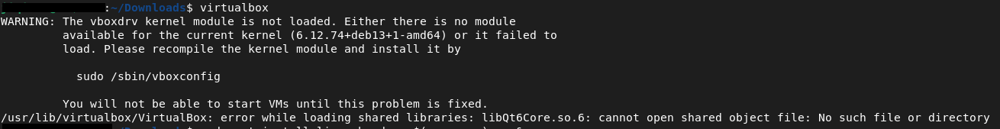

**Solution:**
```bash
sudo apt install linux-headers-$(uname -r) -y 
sudo /sbin/vboxconfig
```

**why:** The linux-headers package provides the kernel source 
files needed for VirtualBox to compile the vboxdrv module. 
Without it, VirtualBox cannot create or run virtual machines.

**Another issue encountered:**

**Issue 2:** Broken dependencies.

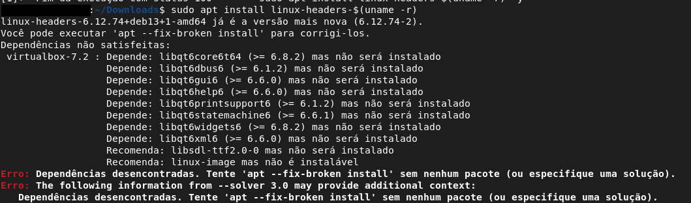

**Solution:**
```bash
sudo apt --fix-broken install
```

After fixing the broken dependencies with `apt --fix-broken install`, 
the kernel module compiled successfully and VirtualBox launched 
without errors.

**Running VirtualBox:**

---
## Step 2 - Creating the Virtual Machine inside of VirtualBox

## 2.1 - Downloading Ubuntu Server
**why:** Downloading Ubuntu Server to install it on our VM and create the lab.

I downloaded it by going in https://ubuntu.com/download/server and clicking the Download button as showed below:

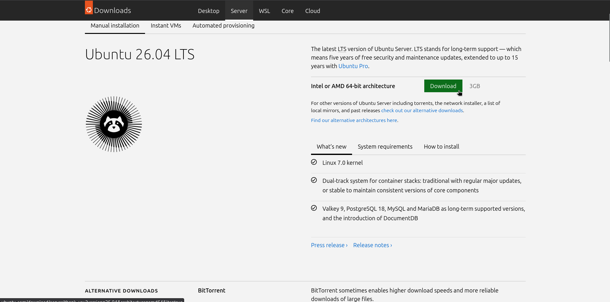

Then it started downloading **ubuntu-26.04-live-server-amd64.iso** (the lab OS).

---
## 2.2 - Creating the VM and installing Ubuntu Server
**what:** Creating a VirtualMachine to make our lab, in Ubuntu server 26.04.

**Specifications:**
- VM Name: Wazuh-Ubuntu-Server
- RAM: 4096MB
- CPUs: 2 cores
- Disk Size: 50GB

**why these specs:** Wazuh Manager requires at least 4GB RAM and 2 CPUs cores to run the indexer and dashboard simultaneously.

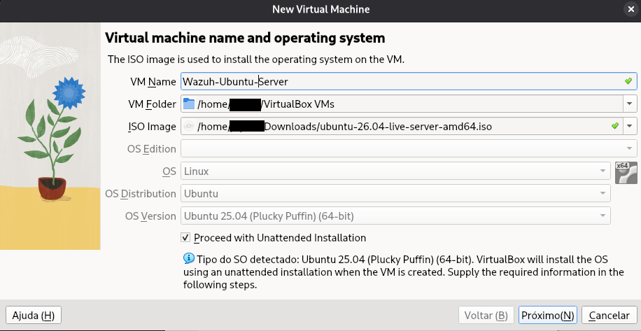

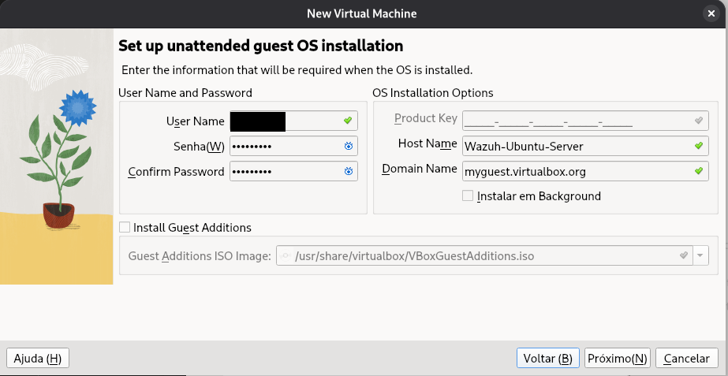

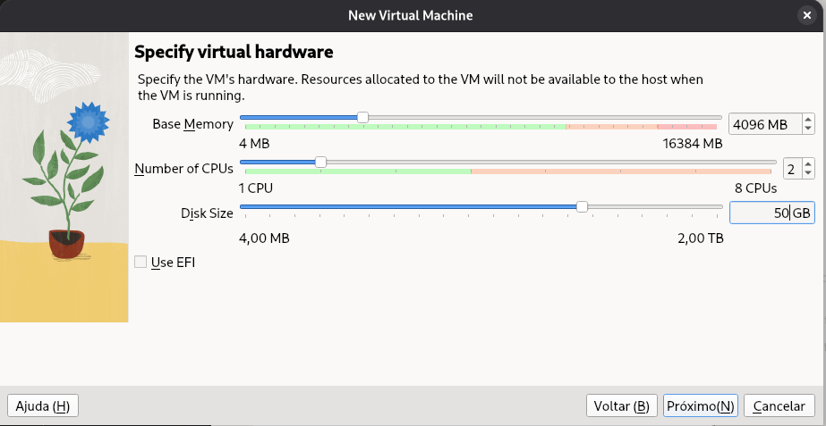

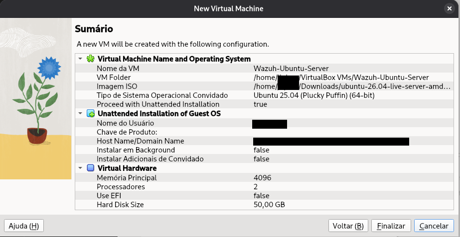

---
## 2.3 - Issue found trying to boot the VM

**Issue:** VT-x disabled in BIOS — VirtualBox was unable to run 64-bit virtual machines.

**Solution 1:** Rebooted into BIOS settings and enabled Intel Virtualization Technology (VT-x) and VT-d under Advanced > CPU Configuration.

**Solution 2:** After enabling VT-x in BIOS, unloaded the conflicting KVM kernel modules to allow VirtualBox to take control of the virtualization layer.

```bash
sudo modprobe -r kvm_intel & sudo modprobe -r kvm
```

**why:** Linux loads KVM modules by default when VT-x is enabled. KVM and VirtualBox cannot use the virtualization hardware simultaneously — removing KVM modules releases control so VirtualBox can function properly.

> ⚠️ **Temporary fix:** This command unloads the KVM modules only for the current session.
> The modules will be reloaded automatically on the next reboot.
> Run this command again whenever you restart the host machine before starting the VM.

**Result:** Working Fine

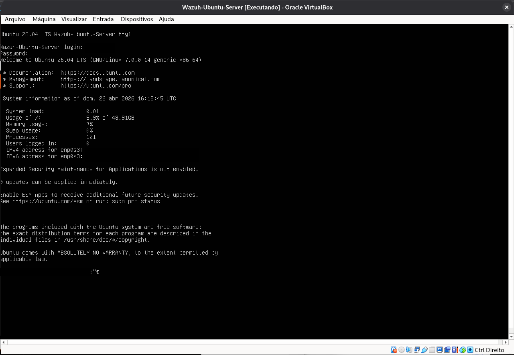

---
## Step 3 - Installing Wazuh

**Command:**
```bash
curl -sO https://packages.wazuh.com/4.7/wazuh-install.sh && sudo bash ./wazuh-install.sh -a -i
```

**What this installs:**
- Wazuh Manager: processes and analyzes security events
- Wazuh Indexer: stores and indexes alerts
- Wazuh Dashboard: web interface for visualization

⚠️**note:** Although used in a controlled lab, production environments should validate package integrity via checksum/GPG before execution.

---
## Step 3.1 - Verifying if wazuh is running

```bash
sudo systemctl list-units | grep wazuh
```
**why:** This allow us to see if the wazuh services are active and running

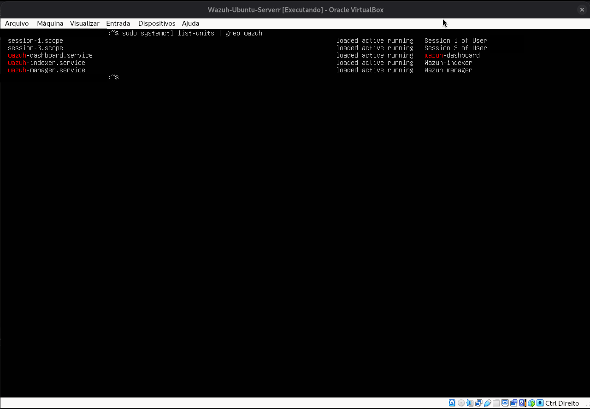

Working fine!

---
## Step 3.2 - Accessing the Wazuh Dashboard

**What:** Accessed the Wazuh Dashboard from the host machine browser 
using the Host-Only network interface IP.

**URL:**  https://VM-IP:443

**Issue 1:** Browser displayed a security warning due to Wazuh's 
self-signed SSL certificate.

**Solution:** Accepted the risk and proceeded — expected behavior 
in a lab environment since the certificate is not issued by a 
trusted certificate authority.

**Result:** Successfully logged into the Wazuh Dashboard.

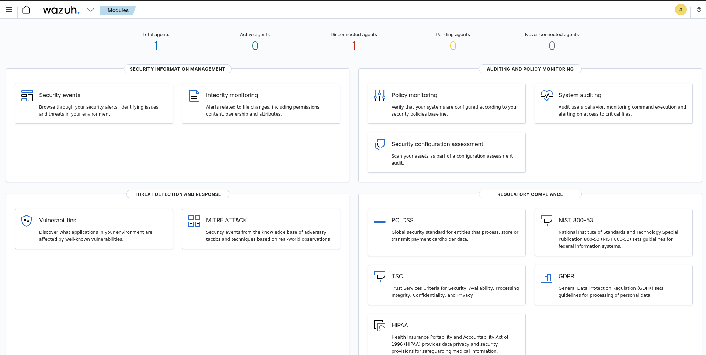

---
## Step 3.3 - Hardening: Rotating Default Credentials

**What:** Rotated all Wazuh credentials using the official password management tool.

**Why:** Regardless of what credentials are set during installation, rotating them after setup
ensures that any credentials exposed during the installation process are invalidated.

**Command:**

```bash
sudo /usr/share/wazuh-passwords-tool.sh -a
```

**What `-a` does:** Automatically rotates all internal Wazuh passwords — Dashboard, Indexer,
and API users — to randomly generated values and updates the configuration files across all
components.

**Result:** All credentials rotated. New credentials stored securely in a password manager.

---
## Step 3.4 - Hardening: Firewall Configuration (UFW)

**What:** Configured UFW (Uncomplicated Firewall) on the VM to restrict
network access to only the ports required by Wazuh.

**Why:** Without a firewall, all ports opened by Wazuh are freely accessible
to any machine on the same network. If the network adapter is ever changed
from Host-Only to Bridged, the entire stack would be exposed with no
additional layer of protection.

**Commands:**

```bash
sudo apt install ufw -y
sudo ufw default deny incoming
sudo ufw default allow outgoing
sudo ufw allow 443/tcp
sudo ufw allow 1514/tcp
sudo ufw allow 1515/tcp
sudo ufw allow 22/tcp
sudo ufw enable
sudo ufw status verbose
```

**Port reference:**

| Port    | Protocol | Purpose                        |
|---------|----------|--------------------------------|
| 443     | TCP      | Wazuh Dashboard (HTTPS)        |
| 1514    | TCP      | Agent to Manager communication |
| 1515    | TCP      | Agent enrollment               |
| 22      | TCP      | SSH access                     |
⚠️**note:** I only allowed port 22 because i'm using SSH.

**Result:** Firewall active. All ports not listed above are blocked by default.
Dashboard and agent communication confirmed working after UFW activation.

⚠️ **Note:** Ports 9200 (Indexer) and 55000 (API) are intentionally not
exposed externally. They are only accessible locally within the VM.

---

## Step 3.5 - Hardening: Locking the Wazuh Repository

**What:** Disabled the Wazuh apt repository after installation to prevent
unintended upgrades.

**Why:** Leaving the repository enabled means a routine `sudo apt upgrade`
could update Wazuh automatically. In a lab environment, uncontrolled upgrades
can break configurations, change behaviors being studied, or create version
mismatches between Wazuh components (Manager, Indexer, and Dashboard must
run on the same version).

**Command:**

```bash
sudo sed -i "s/^deb/#deb/" /etc/apt/sources.list.d/wazuh.list
sudo apt update
```

**Verification:**

```bash
cat /etc/apt/sources.list.d/wazuh.list
```

Expected output:
~~~text
#deb [https://packages.wazuh.com/4.x/apt/](https://packages.wazuh.com/4.x/apt/) stable main
~~~

**Result:** Repository disabled. Wazuh version locked at 4.7.5.

**To re-enable when intentionally upgrading:**

```bash
sudo sed -i "s/^#deb/deb/" /etc/apt/sources.list.d/wazuh.list
sudo apt update
```

---

## Step 3.6 - Hardening: VM Snapshot

**What:** Created a VirtualBox snapshot of the VM after completing the full
installation and hardening steps.

**Why:** A snapshot preserves the exact state of the VM at a known-good
point. In a lab environment where attack simulations and configuration
changes are common, snapshots allow instant rollback without reinstalling
the entire stack.

**How:** In VirtualBox with the VM running:
Machine > Take Snapshot

**Snapshot details:**
- **Name:** Wazuh-Clean-Install  
- **State:** Full installation complete. UFW active. Credentials rotated.
Agent registered and reporting.

**Result:** Snapshot saved. Environment can be restored to this state at
any time via Machine > Restore Snapshot.

---
## Step 4 - Deploying the Wazuh Agent

**What:** Deployed a Wazuh agent on the host machine to monitor local security events and send them to the Wazuh Manager. 

**Why:** The Wazuh agent and Wazuh Manager cannot be installed on the same machine — they conflict with each other. The solution was to install the agent on the host machine, using the VM as the centralized monitoring server.

**Architecture:**
 Host (Debian): Wazuh Agent 
 VM (Ubuntu Server): Wazuh Manager + Indexer + Dashboard

click the *Add agent* option where my cursor is pointing in the picture below:

![[Pasted image 20260501135924.png]]

it should display this deploy agent interface:
![[Pasted image 20260501142332.png]]

I marked DEB amd64 because I'm using a Debian in my Host
Then I pasted my VM Host-only IP in the server address field

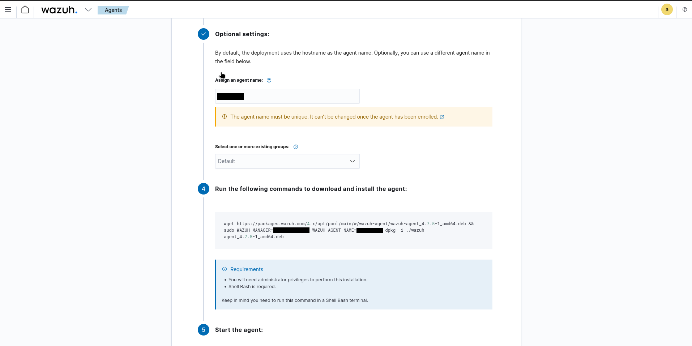

You can insert an agent name if you want and add it to a specific group as shown above.

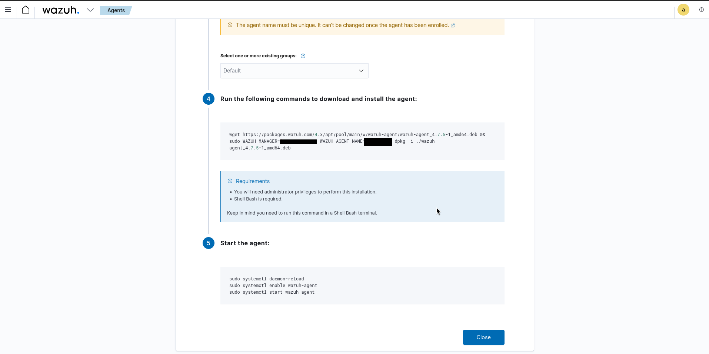

Then copy the generated installation command and pasted it inside the terminal, my installation command generated with my specifications:

**Installation command (run on host):** 
```bash
wget https://packages.wazuh.com/4.x/apt/pool/main/w/wazuh-agent/wazuh-agent_4.7.5-1_amd64.deb && sudo WAZUH_MANAGER='<Host-only IP or VM IP>' WAZUH_AGENT_NAME='<agent-name>' dpkg -i ./wazuh-agent_4.7.5-1_amd64.deb
```
**Issue:** Agent was initially configured with the wrong Manager IP address.

**Why:** The initial installation used an outdated IP address 
from a previous network configuration attempt. After 
reconfiguring the Host-Only network, the VM received a new IP 
that required updating in the agent configuration file.

**Solution:** Updated the Manager address in the agent configuration file:

```bash
sudo nano /var/ossec/etc/ossec.conf
# Updated to the correct VM IP
```

**Starting the agent:** 
```bash
sudo systemctl daemon-reload
sudo systemctl enable wazuh-agent 
sudo systemctl start wazuh-agent
```

**Result:** Agent registered and active. Wazuh Dashboard showing 1 active agent collecting security events from the host machine.

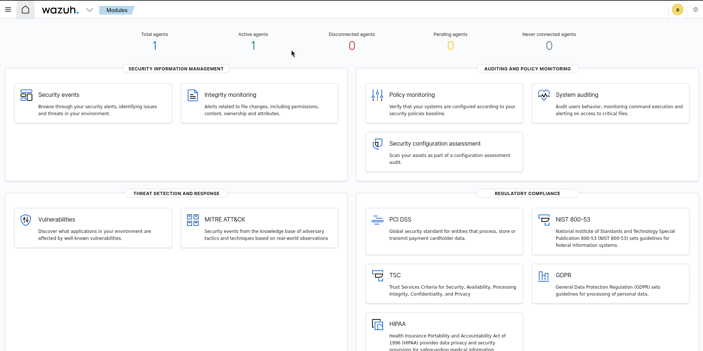

---
## Conclusion

The Wazuh SIEM lab is fully operational with:

- Wazuh Manager, Indexer, and Dashboard running on the VM
- Wazuh Agent deployed on the host machine and actively reporting
- All credentials rotated and firewall configured post-installation
## Next Steps
- Simulate attack scenarios and observe detection in the Dashboard
- Configure custom detection rules
- Explore MITRE ATT&CK mapping within Wazuh